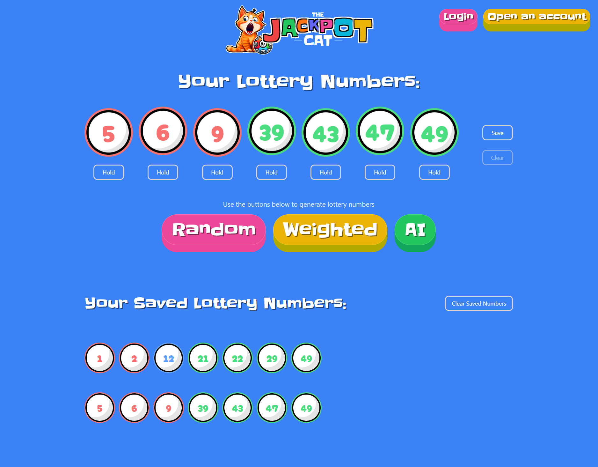

# JackpotCat Frontend

## Overview

JackpotCat Frontend is a rich and vibrant web application built with Next.js and TypeScript, designed to provide users with an interactive experience for generating and saving lottery numbers. The frontend communicates with a backend to fetch predictions which can be generated in three different modes: random, weighted, and AI-based. The user interface is enhanced with NextUI and TailwindCSS, and authentication is managed with NextAuth.js.

## Screenshot



## Core Technologies

- **Next.js**: React framework for server-side rendering and building web applications
- **React.js**: JavaScript library for building user interfaces
- **TypeScript**: Typed superset of JavaScript
- **NextUI**: React component library
- **TailwindCSS**: Utility-first CSS framework
- **NextAuth.js**: Authentication library for Next.js
- **Framer Motion**: Library to create animations
- **Prisma**: ORM for communication with the backend database
- **JWT**: For token-based authentication

## Features

- **Lottery Number Generation**: Users can generate lottery numbers in three different modes:
    - **Random**
    - **Weighted**: Based on the backend API
    - **AI**: Using a pre-trained AI model
- **Saving Lottery Numbers**: Users can save their generated numbers to local storage or, if logged in, persist them to a database.
- **User Authentication**: Passwordless login via email using NextAuth.js
- **Interactive UI**: Vibrant branding, rich colors, and animated components

## File Structure

- **app/**: Main application directory
    - **components/**: React components for the UI
    - **pages/**: Next.js pages
    - **styles/**: Global styles and TailwindCSS configuration
    - **utils/**: Utility functions and configuration for authentication

## Installation

### Prerequisites

Ensure you have the following installed on your machine:

- Node.js (>= 14.x)
- npm (>= 6.x) or Yarn (1.x)

### Clone the Repository

```sh
git clone https://github.com/your-repo/pickyai_frontend.git
cd pickyai_frontend
```

### Install Node.js Dependencies

```sh
yarn install
``

### Configure Environment Variables

Create a `.env.local` file at the root of the project and add the required environment variables:

You may also need to configure environment variables for your email provider if using a passwordless login:


### Build and Start the Project

For development:

```sh
yarn dev
```

For production build:

```sh
yarn build
yarn start
```

### TailwindCSS Configuration

TailwindCSS is already set up in the project. You can configure it further by editing the `tailwind.config.js` file.

## Prisma Setup

Prisma is used for managing database communication. Ensure your backend Prisma setup is correctly configured, as the frontend relies on it for authentication and data persistence. After configuring `DATABASE_URL` in your `.env.local` file, you can use the Prisma client:

```sh
yarn prisma generate
```

## Usage

Upon starting the project, you can access the application via `http://localhost:3000`. Use the interface to generate and save lottery numbers. Authentication will involve entering your email, receiving a login link, and accessing the application.

## Contributing

Feel free to fork the repository, submit issues, and send pull requests. Contributions are welcome!

## License

This project is licensed under the MIT License.